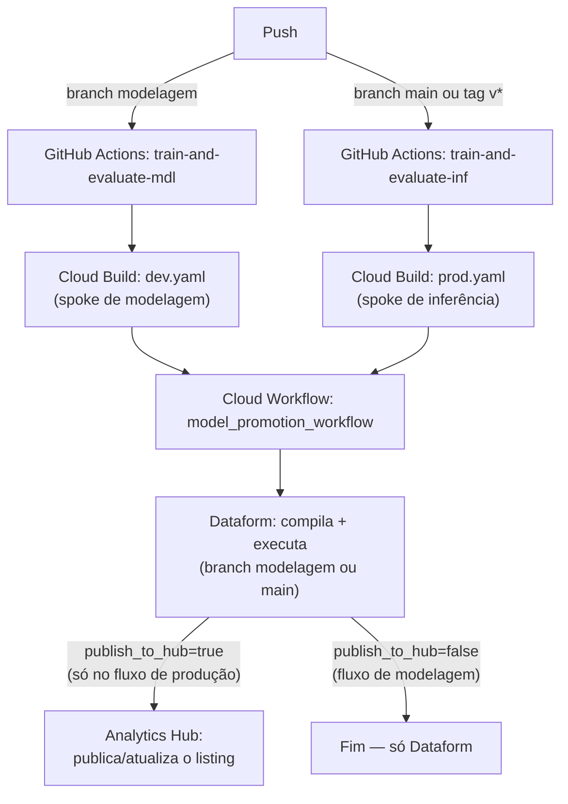

# CI/CD — Treino e Promoção de Modelo (MLOps)

Pipeline de CI/CD para treino e promoção de modelo em arquitetura hub-and-spoke: o GitHub Actions dispara o Cloud Build (`dev.yaml` para modelagem, `prod.yaml` para inferência) — os dois seguem **o mesmo fluxo**: implantam e disparam de forma assíncrona um Cloud Workflow que compila/executa o Dataform, cada um apontando pro seu próprio spoke (`dev.yaml` → ambiente de modelagem, `prod.yaml` → ambiente de inferência). A publicação do listing no Analytics Hub só roda no lado de produção — `dev.yaml` passa `publish_to_hub=false` (modelagem só compila/roda o Dataform), `prod.yaml` passa `publish_to_hub=true`.

> Este pipeline vive na subpasta `dataform-workflow/` do repositório — a raiz é do projeto Dataform (`workflow_settings.yaml`, `definitions/`, ...), que exige ficar na raiz do repositório Git. A única exceção é `.github/workflows/deploy.yml`, que fica na raiz por exigência do próprio GitHub (só reconhece workflows ali). Todos os caminhos abaixo já consideram isso.

## Arquitetura



Os dois `.cloudbuild/*.yaml` implantam a **mesma definição** de Cloud Workflow (`pipelines/model_promotion_workflow.yaml`) em projetos diferentes e a disparam de forma assíncrona logo em seguida — o Cloud Build não espera o Dataform terminar.

## O que este pipeline cobre

Cobre a **esteira de CI/CD completa**: gatilho do GitHub Actions, os dois arquivos do Cloud Build (idênticos em estrutura, cada um apontando pro seu ambiente em `model-config.yaml`), o `model-config.yaml` que os alimenta e o Cloud Workflow de promoção (Dataform, seguido de Analytics Hub só quando `publish_to_hub=true`) que ambos implantam/disparam — `dev.yaml` roda só o Dataform, `prod.yaml` roda Dataform + publica o listing.

## Estrutura

```text
<raiz do repositório>/                       # projeto Dataform (workflow_settings.yaml, definitions/, ...)
├── .gitattributes                           # força LF em .env/.sh/.yaml/.yml (evita CRLF quebrando bash em runners Linux)
├── .github/workflows/
│   └── deploy.yml                           # gatilho de CI/CD — lê vars.env em cada run
└── dataform-workflow/
    ├── vars.env                             # variáveis do produto/modelo (projetos, região, service accounts, ...)
    ├── apply-vars.sh                        # motor de substituição dos placeholders __CHAVE__
    ├── .gcloudignore                        # exclui do source enviado ao Cloud Build o que ele não precisa
    ├── model-config.yaml                    # config declarativa dos ambientes de treino/inferência
    ├── .cloudbuild/
    │   ├── dev.yaml                         # implanta + dispara o Cloud Workflow no spoke de modelagem (branch)
    │   └── prod.yaml                        # implanta + dispara o Cloud Workflow no spoke de inferência (tags v*)
    └── pipelines/
        └── model_promotion_workflow.yaml    # Cloud Workflow de promoção (Dataform + Analytics Hub)
```

## Como funciona

`deploy.yml` **não tem nenhum placeholder** — nunca precisa ser editado além do que já vem configurado. Toda a configuração de projeto/região/worker pools vem de `dataform-workflow/vars.env`, lido do zero a cada execução do workflow:
- Um job `load-config` faz checkout, lê `vars.env` e repassa os valores (projetos, região, worker pools) pros outros jobs via `needs.load-config.outputs` — só assim dá pra usar esses valores no `if:`/`env` dos jobs de treino, já que o `if:` de um job é avaliado antes de qualquer step dele rodar. As branches que disparam cada job (`modelagem`/`main`) são hardcoded direto no `if:` de cada job, não vêm de `vars.env`.
- Os jobs `train-and-evaluate-mdl`/`train-and-evaluate-inf` rodam `apply-vars.sh` logo depois do checkout — isso resolve os placeholders de `model-config.yaml` e os defaults de `.cloudbuild/*.yaml` **só no workspace daquele run**, nunca commitado. Na sequência, `gcloud builds submit` envia esse workspace já resolvido pro Cloud Build.

Ou seja: **nenhum commit automático acontece** — nem para preencher placeholders, nem depois. `vars.env` é um arquivo normal e permanente do repositório, do mesmo jeito que `model-config.yaml`; editar um valor (trocar projeto, região, etc.) é só um commit de `vars.env`, sem precisar rodar nada.

**Gatilhos:**
- Push na branch `modelagem` dispara `train-and-evaluate-mdl`.
- `train-and-evaluate-inf` dispara em **duas** situações — uma tag `v*`, ou push na branch `main` — o que vier primeiro.

Não precisa de nenhum secret além dos já existentes (`workload_identity_provider_gcp`, `service_account_gcp`) — como nada é commitado de volta, não existe a restrição do GitHub sobre alterar `.github/workflows/` (essa trava só se aplica quando o próprio Actions tenta dar push num arquivo de workflow; aqui isso nunca acontece).

## Variáveis (`vars.env`) e placeholders (`__CHAVE__`)

| Placeholder | Chave em `vars.env` | Onde aparece | Exemplo |
|---|---|---|---|
| `__dataset_id__` | `DATASET_ID` | `model-config.yaml` | `served` |
| `__region__` | `REGION` | `.cloudbuild/dev.yaml`, `.cloudbuild/prod.yaml`, `model-config.yaml`, `model_promotion_workflow.yaml` (default de `location`/`ah_location`) | `southamerica-east1` |
| `__train_project_id__` | `TRAIN_PROJECT_ID` | `model-config.yaml`; lido também em runtime por `deploy.yml` (job `load-config`) | `prj-meuproduto-mdl-prd` |
| `__serving_project_id__` | `SERVING_PROJECT_ID` | `model-config.yaml`; lido também em runtime por `deploy.yml` (job `load-config`) | `prj-meuproduto-inf-prd` |
| `__hub_project_id__` | `HUB_PROJECT_ID` | `.cloudbuild/dev.yaml`, `.cloudbuild/prod.yaml` | `prj-hub-poc` |
| `__train_pipeline_root__` | `TRAIN_PIPELINE_ROOT` | `model-config.yaml` | `gs://bucket-.../pipeline_root` |
| `__serving_pipeline_root__` | `SERVING_PIPELINE_ROOT` | `model-config.yaml` | `gs://bucket-.../pipeline_root` |
| `__train_service_account__` | `TRAIN_SERVICE_ACCOUNT` | `model-config.yaml` | `sa-vertex-ai-pipeline@...` |
| `__serving_service_account__` | `SERVING_SERVICE_ACCOUNT` | `model-config.yaml` | `sa-vertex-ai-pipeline@...` |
| `__artifact_registry_index_url__` | `ARTIFACT_REGISTRY_INDEX_URL` | `.cloudbuild/dev.yaml`, `.cloudbuild/prod.yaml` | URL do índice PyPI privado |
| `__workflow_name__` | `WORKFLOW_NAME` | `.cloudbuild/dev.yaml`, `.cloudbuild/prod.yaml` | `meuproduto-model-promotion-workflow` |
| `__dataform_repository_id__` | `DATAFORM_REPOSITORY_ID` | `.cloudbuild/dev.yaml`, `.cloudbuild/prod.yaml` | `df-repo-meuproduto` |
| `__dataform_sa_prefix_train__` | `DATAFORM_SA_PREFIX_TRAIN` | `.cloudbuild/dev.yaml` | `sa-df-meuproduto-mdl` |
| `__dataform_sa_prefix_serving__` | `DATAFORM_SA_PREFIX_SERVING` | `.cloudbuild/prod.yaml` | `sa-df-meuproduto-inf` |
| `__data_exchange_id__` | `DATA_EXCHANGE_ID` | `.cloudbuild/dev.yaml`, `.cloudbuild/prod.yaml` | `exchange_meuproduto` |
| `__listing_id__` | `LISTING_ID` | `.cloudbuild/dev.yaml`, `.cloudbuild/prod.yaml` | `listing_meuproduto` |
| — *(hardcoded em `deploy.yml`, não em `vars.env`)* | branches `modelagem`/`main` | `if:` dos jobs `train-and-evaluate-mdl`/`train-and-evaluate-inf` | `modelagem`, `main` |
| — *(hardcoded em `.cloudbuild/dev.yaml`/`prod.yaml`, não em `vars.env`)* | `git_commitish` | `workflow_inputs` — branch do repo Dataform a compilar; `dev.yaml` manda `modelagem`, `prod.yaml` manda `main` | `modelagem`, `main` |
| — *(sem placeholder — só runtime)* | `WORKERPOOL_DEV` | Lido em runtime por `deploy.yml` (job `load-config`) | `workerpool-meuproduto-mdl` |
| — *(sem placeholder — só runtime)* | `WORKERPOOL_PROD` | Lido em runtime por `deploy.yml` (job `load-config`) | `workerpool-meuproduto-inf` |
| — *(sem placeholder — só runtime)* | `CLOUDBUILD_SERVICE_ACCOUNT_NPRD` | Lido em runtime por `deploy.yml` — passado como `--service-account` no `gcloud builds submit` do job MDL | `projects/prj-.../serviceAccounts/sa-cloudbuild-mdl@....iam.gserviceaccount.com` |
| — *(sem placeholder — só runtime)* | `CLOUDBUILD_SERVICE_ACCOUNT_PRD` | Lido em runtime por `deploy.yml` — passado como `--service-account` no `gcloud builds submit` do job INF | `projects/prj-.../serviceAccounts/sa-cloudbuild-inf@....iam.gserviceaccount.com` |

`pipeline_root`, `template_uri` e `service_account` (Vertex AI), montados em `model-config.yaml`/passados ao Cloud Workflow, existem em `init_variables` do workflow mas não são usados em nenhum step dele hoje — ficam ali como reserva para o dia em que o workflow também disparar um pipeline de treino/deploy do Vertex AI.

## Três mecanismos de variável — não confunda os três

1. **Placeholders `__CHAVE__`** (`model-config.yaml`, `.cloudbuild/*.yaml`, `model_promotion_workflow.yaml`): resolvidos por `apply-vars.sh` em runtime, dentro do job de treino, a cada execução.
2. **Chaves lidas direto de `vars.env` em runtime** (`WORKERPOOL_DEV`, `WORKERPOOL_PROD`, `CLOUDBUILD_SERVICE_ACCOUNT_NPRD`, `CLOUDBUILD_SERVICE_ACCOUNT_PRD`, e também `TRAIN_PROJECT_ID`/`SERVING_PROJECT_ID`/`REGION` no job `load-config`): nunca viram `__PLACEHOLDER__` em arquivo nenhum — `deploy.yml` extrai cada uma direto do arquivo (`grep`/`cut`) e usa o valor na hora. As branches (`modelagem`/`main`) e o `git_commitish` do Dataform NÃO entram nesse mecanismo — são hardcoded direto no `if:` de cada job (`deploy.yml`) e no `workflow_inputs` de cada `.cloudbuild/*.yaml`, justamente pra cada ambiente sempre apontar pro seu próprio valor sem depender de uma chave compartilhada em `vars.env`.
3. **`substitutions:` do Cloud Build** (dentro de `.cloudbuild/dev.yaml`/`prod.yaml`, ex.: `_REGION`, `_TAG_NAME`): esses `_VAR` do Cloud Build já vêm resolvidos pelo mecanismo 1 (via `apply-vars.sh`) antes do `gcloud builds submit`; a exceção é `_TAG_NAME`, que continua sendo passado por `--substitutions` a cada build (é a tag da release, varia a cada execução, não faz sentido vir de `vars.env`).

## Pré-requisitos (antes do primeiro push)

Recursos que precisam já existir nos projetos de destino — este pipeline não os cria, só os referencia:

- **APIs habilitadas** em cada projeto: Cloud Build, Cloud Workflows, Dataform e, se `publish_to_hub=true`, Analytics Hub.
- **Repositório Dataform** já criado em cada projeto (`DATAFORM_REPOSITORY_ID`), com `workflow_settings.yaml`/`definitions/` na raiz do repositório Git e as branches `modelagem`/`main` disponíveis no remoto — é o que `git_commitish` vai referenciar.
- **Service accounts do Dataform** (`DATAFORM_SA_PREFIX_TRAIN`/`_SERVING`) já criadas em cada projeto, com permissão para executar o Dataform.
- **Worker Pools privados do Cloud Build** (`WORKERPOOL_DEV`/`WORKERPOOL_PROD`) e as **service accounts de execução do Cloud Build** (`CLOUDBUILD_SERVICE_ACCOUNT_NPRD`/`_PRD`) já provisionados, com permissão de rodar build no respectivo projeto.
- **Secrets do repositório GitHub**: `workload_identity_provider_gcp` e `service_account_gcp` (Workload Identity Federation) — a identidade autenticada por eles precisa poder submeter builds usando `CLOUDBUILD_SERVICE_ACCOUNT_NPRD`/`_PRD`.
- Se `publish_to_hub=true`: a **Data Exchange** do Analytics Hub (`DATA_EXCHANGE_ID`) já criada no projeto `HUB_PROJECT_ID`.

## Checklist do primeiro deploy

1. Preencha `dataform-workflow/vars.env` com os valores reais — confira principalmente buckets e service accounts, que costumam ter nomes com pequenas variações reais do que está documentado.
2. Confirme os pré-requisitos acima nos projetos de destino.
3. Rode o fluxo de ponta a ponta contra um projeto de teste — `dev.yaml`/`prod.yaml` implantam e disparam o Cloud Workflow (Dataform + Analytics Hub).
4. Acompanhe pela aba **Actions** do GitHub e, se precisar depurar, pelos logs do Cloud Build (o step `trigger-cloud-workflow-async` imprime o JSON completo enviado ao workflow) e pela aba **Workflows** do Console GCP (execução do Dataform/Analytics Hub).
